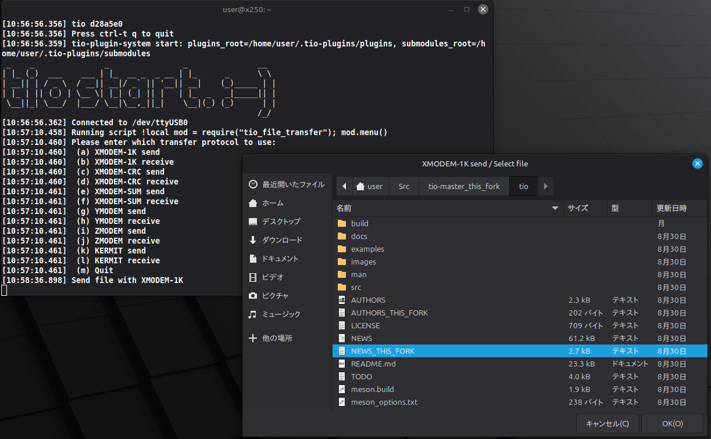
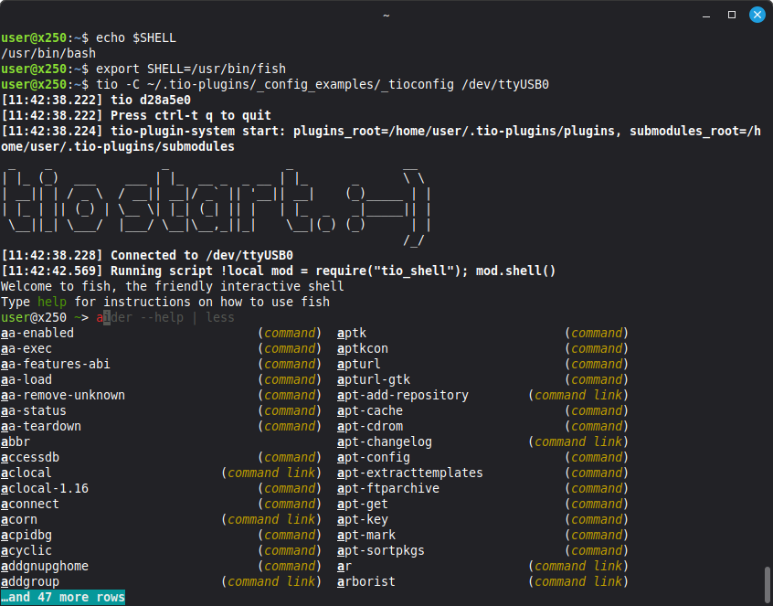

# tio-plugins

tio-plugins is a collection of Lua applications and utilities that extend tio.

It includes tios, a utility library that provides common functionality for building interactive
applications on top of tio, such as TUI menus, dialogs, terminal-mode switching, and command integration.

Plugins are simply Lua modules placed in the specified location.
There is currently no plugin management mechanism.

This project currently requires the develop branch of my
[fork of tio](https://github.com/yabu76/tio/tree/develop_this_fork).

Please note that this program is free software provided under the GPLv2+ License,
and you use it at your own risk.

The project aims to remain small and simple.
However please feel free to send contributions, feature requests,  bug-fixes, bug-report and suggenstions.


## Background

`tio` features Lua scripting capabilities that allow you to execute Lua code during a terminal session.
However, there are some limitations using the standard distribution:

1. There is no built-in API for building reusable TUI/GUI applications or complex workflows.
2. Integration with Lua modules installed via LuaRocks is not natively supported.
3. Managing reusable Lua code spread across multiple files can become cumbersome.
4. There is no method available to build scripts that filter input/output data in the background and
   use them by chaining them together.
5. There is no methods to build background scripts using time and timer.
...

I have been extending my fork of tio and developing applications and utility libraries around its Lua API.
I believe I have now addressed the first three limitations, so I decided to release this project.

I have not addressed items 4 and 5 yet, because I want to avoid introducing background processing
that could negatively affect tio performance.

My fork of tio is configured to prioritize linking against LuaJIT by default
if it is available. Using LuaJIT is **recommended** for better performance.


## Features

- Reusable utilities for building interactive applications
- Custom TUI menus and dialogs
- Terminal-mode switching for interactive applications
- Loading Lua applications and plugins using `require()`
- Integration with shell commands and external tools


## Screenshots

* tio_file_transfer plugin (Ctrl-t X)
[]()

* tio_shell plugin (Ctrl-t S)
[]()

## Requirements

### Mandatory

- My [fork of tio](https://github.com/yabu76/tio/tree/develop_this_fork)
- LuaRocks
- LuaRocks module: `luafilesystem`

### Recommended

- LuaJIT

### Required by specific plugins

- Zenity — `tios`: GUI support
- lrzsz — `tio_file_transfer`: X/Y/ZMODEM support
- G-Kermit — `tio_file_transfer`: Kermit support

### Optional

- LuaRocks module: `debugger` (if using debugger functionality)


## Quick Start

Here is how to try it out, using Ubuntu as an example.

### (1) Install the necessary packages:

```bash
sudo apt install luajit libluajit-5.1-dev
sudo apt install luarocks
sudo luarocks-5.1 luafilesystem
sudo apt install zenity
sudo apt install lrzsz gkermit
```

### (2) Install the plugins

Place this repository in your home directory and name it `.tio-plugins`. Either check it out using git as shown below,

```bash
git clone --depth 1 https://github.com/yabu76/tio-plugins.git ~/.tio-plugins
```

or download the repository as a zip file, extract it, rename the folder to the name shown above, and place it in the appropriate location.

```bash
unzip tio-plugins-master.zip
mv tio-plugins-master ~/.tio-plugins
```

### (3) Adjust the sample configuration file `_tioconfig`

In the sample configuration file `_tioconfig`, replace `/home/your_name/` in the line below
with the full path to your home directory.
For example, if your home directory is `/home/user`:

Original:
```ini
script-init-file = /home/your_name/.tio-plugins/_config_examples/_tio-script-init.lua
```

Modified:
```ini
script-init-file = /home/user/.tio-plugins/_config_examples/_tio-script-init.lua
```

### (4) Launch `tio` specifying the sample configuration file.

```bash
tio -C ~/.tio-plugins/_config_examples/_tioconfig /dev/ttyUSB0
```

If `:-)` is displayed in large characters, the setup was successful.

### (5) Try out the key-bound functions.

Ctrl-t 1, Ctrl-t 2, Ctrl-t S, Ctrl-t X


## Installation

1. Install the required packages listed in the Quick Start section.

2. Install this repository in a location of your choice. For example:

```text
/home/your_name/.tio-plugins
```

3. Editing your tio configuration file (ex. ~/.tioconfig)

Please ensure that .tio-script-init.lua is referenced.

For example, if you have placed it in /home/user, configure the settings as follows.
```ini
script-init-file = /home/user/.tio-script-init.lua
```
Note: Environment variables and shell expansion such as $HOME and ~ cannot be used.

A sample configuration file is provided:
```text
_config_examples/_tioconfig
```

4. Editing .tio-script-init.lua

A sample configuration file is provided:

```text
_config_examples/_tio-script-init.lua
```

Please use this as a reference and customize it as needed.


## Loading Plugins

Plugins are loaded using the standard Lua `require()` mechanism.

Plugins use the .tio file extension by convention because they are intended to use
the Lua API provided by tio. Files with the .lua extension can also be loaded.

Of course, you can also load files with the .lua extension.

Example:

```lua
tio_toy = require("tio_toy")
```

Once a plugin is loaded, its functions become available for use within `tio`:

```lua
tio_toy.banner()
```

To restart the Lua interpreter during a session:
```text
Ctrl-t r
@new
``` 


## Keyboard Shortcuts

Plugin functions can be assigned to keyboard shortcuts within `.tio-script-init.lua`.

This allows you to directly execute frequently used operations while working in a `tio` session.

Please refer to the configuration examples for details.


### Shortcut Examples

The following shortcuts are defined in the configuration example:

| Shortcut | Action |
|----------|----------|
| Ctrl-t X | Launch file transfer TUI (GUI-based file selection) |
| Ctrl-t S | Launch interactive shell (CUI) |
| Ctrl-t 1 | Tower of Hanoi (CUI) |
| Ctrl-t 2 | Bouncing ball (CUI) |


## Included Plugins

### tios

A utility library for developing `tio` plugins.
`tios` is the common utility library used by the included applications.

Key features:

- Custom TUI command menus
- Zenity-based dialogs
- Error messages
- Warning messages
- File selection dialogs
- Terminal configuration helpers
- Other utility functions

How to load:

```lua
tios = require("tios")
```

### tio_toy

Provides "toy programs" that run within `tio`.

How to load:

```lua
tio_toy = require("tio_toy")
```

How to invoke:

```text
Ctrl-t r
! tio_toy.banner()

Ctrl-t r
! tio_toy.hanoi()

Ctrl-t r
! tio_toy.ball()
```

You can create shortcuts as needed. (See `_config_examples/_tio-script-init.lua`)


### tio_shell

Provides access to an interactive shell from within `tio`.

Shell selection order:

1. The shell specified by the `SHELL` environment variable.
2. `/bin/sh` if `SHELL` is not set.

Exiting the shell returns you to `tio`. 

Loading:

```lua
tio_shell = require("tio_shell")
```

Invocation:

```text
Ctrl-t r
! tio_shell.shell()
```


### tio_file_transfer

The file transfer TUI provides a graphical file selection interface and supports the following protocols:

- XMODEM
- YMODEM
- ZMODEM
- Kermit

For convenience, the XMODEM/YMODEM/ZMODEM protocol family is sometimes collectively referred to as **XYZMODEM**.

Loading:

```lua
tio_file_transfer = require("tio_file_transfer")
```

Invocation:

```text
Ctrl-t r
! tio_file_transfer.menu()
```


### tio_debugger

A `tio` adapter for `debugger.lua`.

This plugin enables interactive debugging of Lua plugins running within `tio`.

To use this, please install `debugger.lua`.

Please check the `debugger.lua` website for usage instructions.

Project:

- [debugger.lua](https://codeberg.org/slembcke/debugger.lua)

Installation:

```bash
luarocks install debugger
```


## Creating Plugins

Plugins are simply Lua modules placed in the following directory:

```text
~/.tio-plugins/plugins/
```

For example, create the following  `hello` plugin:

```text
~/.tio-plugins/plugins/hello/init.tio
```

```lua
-- Hello

local M = {}

local term = require("tios.term")

function M.hello()
    term.print("Hello.")
end

return M
```

The plugin can then be loaded and assigned to a keyboard shortcut in
`~/.tio-script-init.lua`:

```lua
hello = require("hello")

tio.set_keymap('@0=!hello.hello()')
```

Start `tio` and press `Ctrl-t 0`:

```text
user@x250:~$ tio /tmp/ttyNL0
[15:39:29.126] Running script !hello.hello()
Hello.
```

This is all that is required to create a simple `tio` plugin.


## Directory Structure

```text
~/.tio-plugins/
├── bootstrap/                <-- Auxiliary code for initializing the plugin system
├── core/                     <-- Core plugin-system code
├── plugins/                  <-- Plugin location
│      ├── tios/
│      ├── tio_file_transfer/
│      ├── tio_shell/
│      ├── tio_toy/
│      ├── tio_debugger/
│      ├── your_plugin_a/    <-- Plugins you add
│      └── your_plugin_b/
└── submodules/               <-- Lua modules not managed by LuaRocks
        ├── your_lua_module_a/
        └── your_lua_module_b/
```

The `plugins/` directory is where tio plugins that rely on the tio API are placed.

The `submodules/` directory is where independent Lua modules that intends not to be extensions of tio are placed here.

Note: Modules installed via LuaRocks are managed by LuaRocks, so they are not placed in submodules directory.


## License

tio-plugins is GPLv2+.
See the [LICENSE](LICENSE) file for more details.

## Plugins License

The plugins included in this distribution are licensed under GPLv2+.

For plugins distributed as part of this repository, GPLv2+ is the preferred license.

## Submodules License

The submodules to be added must be independent Lua modules that do not depend on tio.
The license for each submodule will be determined individually.

If distribution is intended, it is preferred to use a license compatible with GPLv2+ (such as MIT, Apache, or BSD).
